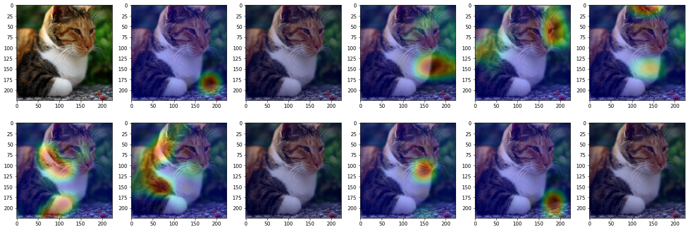
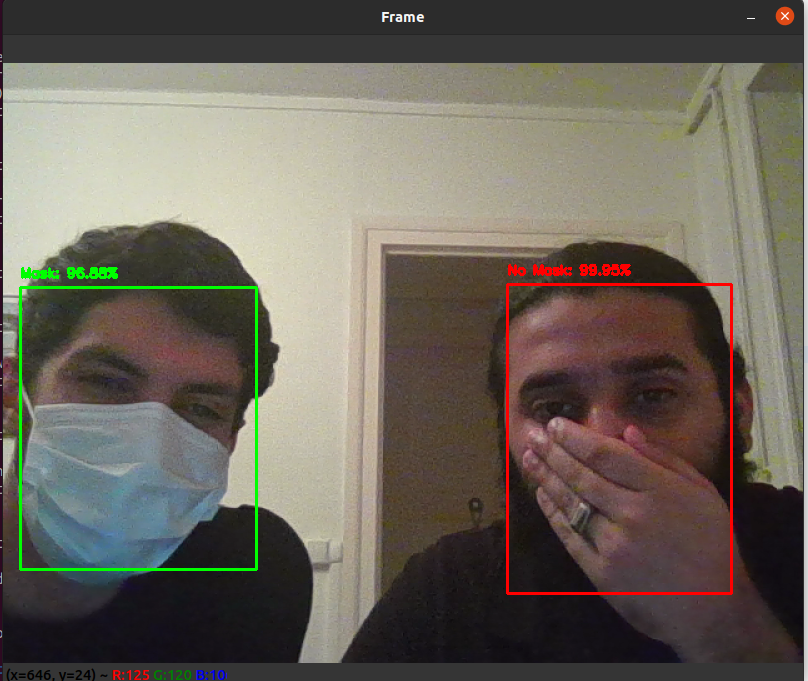
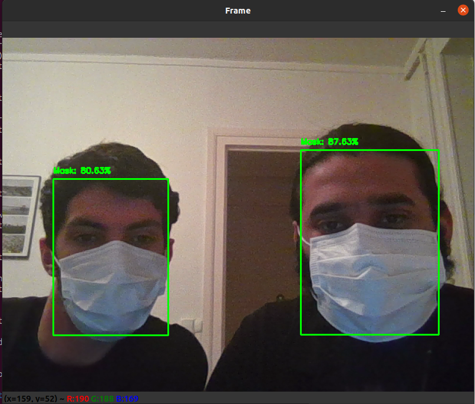
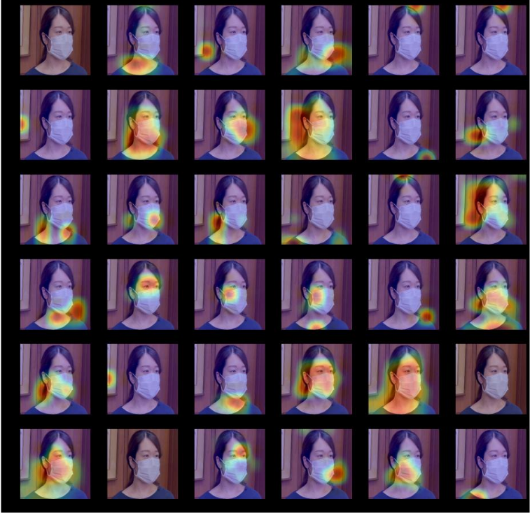
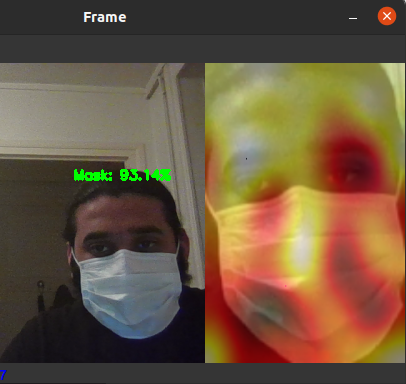
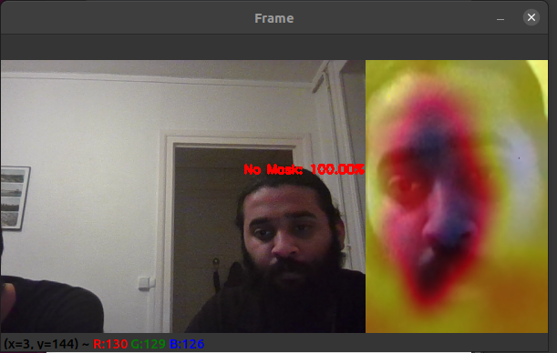

# **Face mask recognition**

## About the code

The requirements are given inside the 'Face_mask Detection' folder.

## **Installation**

1. conda create -n mask_de  
2. conda activate mask_de  
3. cat requirements.txt \| xargs -n 1 conda install  
4. conda install pip  
5. cat requirements.txt \| xargs -n 1 pip install

## **Run demo**

1. conda activate mask_de  
2. python detect_cam.py -m mask-detector.model

## **Run heatmap**

1. conda activate mask_de  
2. python heatmap_cam.py -m mask-detector.model

## My system:

Alienware m-17 R3 <br>
Intel® Core™ i7-10875H CPU @ 2.30GHz × 16 <br>
Nvidia RTX 2080 super <br>
Memory: 32 GB <br>
OS: Ubuntu 20.04.5 LTS <br>

# Background

Since the 2020 epidemic, wearing masks to travel has become a normal
part of life. However, detecting faces with masks has been a challenging
task due to the mask’s obscuring of facial features. Automatic
monitoring of mask wear in public places has become an important problem
that needs to be addressed urgently in epidemic prevention and control.
In this project, we will be able to identify people who are not wearing
masks using Convolutional Neural Networks – CNN

## Motivation

According to World Health Organisation (WHO) which declared COVID19 as a
very deadly virus that can spread fast,so in order to prevent the spread
of the pandemic lead to the mandatory wearing of the fact mask. That’s
what gave birth to the inspirations or motivations behind this project
in other for us to assist the government in our own little way to help
save life and also to reduce the spread of the deadly virus. Artificial
intelligence supports image and video-based detection methods which can
detects an object with high accuracy and classify whether the human is
wearing or not wearing a mask. Face mask identification can be done
using deep learning and machine learning methods such as “Support Vector
Machines” and “Decision Trees”, but with different datasets.The method
of recognizing whether or not someone is wearing a mask and where his
face is located is known as face mask detection.

## Objective

As engineers, we want to set up a camera at a practical location which
will detect faces wearing masks as well as faces without masks. So to
ensure this, we will use a light weight NN with a pre-trained model.

## Challenges

-   Someone might cover their mouth and nose with their hand or textbook
    to trick the neural network.

-   The angle of the camera is important. The camera will be looking
    down at the object and if we only had faces looking directly at the
    camera in our dataset, the recognition accuracy would be poor.

## Physical Application

We can apply this project in two major aspect,

-   It can be applied at the entrance of a building to help detect an
    unmasked person and send signal or notification to the custodian
    that a person is unmasked.

-   It can also be applied in an open field with the help of a plane or
    drone to detect people that are unmasked.

# Methodology

In 2012, AlexNet proposed by Krizhevsky et al. achieved a top5 error
rate of 15.3% on the Image Net dataset, which far exceeded other
traditional feature extraction methods and ignited the deep learning
boom. The application of deep learning in computer vision tasks is
becoming more and more effective, while the size of the models is
becoming larger and larger. The huge parameters and computation of large
networks, which usually can only run on high-calculus GPUs, prompted the
deep learning branch to turn to lightweight research. The earliest
lightweight neural network is Squeeze Net proposed in 2016, which
maintains the accuracy of Alex Net, but the number of model parameters
is only 1/540 of AlexNet. lightweight neural networks have been
developed so far, and there are a series of lightweight networks such as
SqueezeNet, ShuffleNet, Xception, MobileNet which are smaller in size
and faster in speed while ensuring accuracy. The emergence of these
models has made it possible to run deep learning models directly on edge
devices.  
Target detection and recognition algorithms are divided into two types:

-   Two-Stage methods, such as the R-CNN series of algorithms, which
    first generate a series of sparse candidate frames, and then
    classify and regress these candidate frames.

-   One-Stage algorithms, such as Yolo, SSD, etc., whose main idea is to
    densely sample uniformly at different locations of the image, using
    different scales and aspect ratios for classification and
    regression, the whole process takes only one step, and accordingly
    its operation speed is much better than Two-Stage methods.

For this project, we will use the MobileNet V2 for mask detection. There
are two steps in detecting face masks, talking in terms of the neural
network i.e., detecting the face and detecting the mask.  

## MobileNet V2

MobileNetV2 is a convolutional neural network (CNN) designed for
efficient and effective on-device image classification. It was developed
by Google and introduced in the MobileNetV2 paper in 2018.  
MobileNetV2 is an updated version of MobileNetV1, a lightweight CNN
designed for mobile devices. Like its predecessor, MobileNetV2 is
designed to be small and efficient, making it well-suited for use in
mobile applications where processing power and memory resources are
limited.  
One key feature of MobileNetV2 is its use of inverted residual blocks
with linear bottlenecks. These blocks allow the network to use less
computation and parameters while still achieving good accuracy. The use
of linear bottlenecks also allows the network to be more efficient by
reducing the number of non-linearities in the network.  
Another important feature of MobileNetV2 is its use of depthwise
separable convolutions. In a standard convolutional layer, the input is
convolved with a set of filters to produce an output feature map. In a
depthwise separable convolution, the input is first convolved with a set
of depthwise filters, which operate on individual input channels. The
output of the depthwise convolution is then passed through a pointwise
convolution, which combines the depthwise output features using a set of
pointwise filters. This allows the network to use fewer parameters and
less computation, while still maintaining good performance.  
Overall, MobileNetV2 is a useful CNN architecture for efficient
on-device image classification, and has been widely used in a variety of
mobile applications.  

### MobileNet V2 vs MobileNet V1

There are a few key differences between the two versions:

-   Inverted residual blocks with linear bottlenecks: MobileNetV2 uses
    inverted residual blocks with linear bottlenecks, which allow the
    network to use less computation and parameters while still achieving
    good accuracy. In contrast, MobileNetV1 uses standard residual
    blocks.

-   Depthwise separable convolutions: Both versions of MobileNet use
    depthwise separable convolutions, which allow the network to use
    fewer parameters and less computation while maintaining good
    performance. However, MobileNetV2 uses a modified version of
    depthwise separable convolutions that is more efficient and has
    better performance.

-   Input resolution: MobileNetV2 is designed to handle a larger input
    resolution (up to 224x224) compared to MobileNetV1 (which is limited
    to 160x160).

Overall, MobileNetV2 is generally considered to be an improvement over
MobileNetV1, with better performance and higher accuracy. However, the
specific choice of architecture will depend on the needs of the
application and the available resources.

<figure id="fig:MobileNet v1 vs V2">

<figcaption>MobileNet v1 vs V2</figcaption>
</figure>

The above figure
(<a href="#fig:MobileNet v1 vs V2" data-reference-type="ref"
data-reference="fig:MobileNet v1 vs V2">1</a>) summarizes the difference
MobileNet V1 and MobileNet V2.

### Architecture of MobileNet V2

<figure id="fig:Architecture of MobileNet V2">

<figcaption>Proposed Architecture of NN</figcaption>
</figure>

The
figure(<a href="#fig:Architecture of MobileNet V2" data-reference-type="ref"
data-reference="fig:Architecture of MobileNet V2">2</a>) on the previous
page defines the architecture of our Neural Network.  
The architecture of MobileNet V2 consists of a series of convolutional
layers, followed by a series of fully connected (FC) layers. The
convolutional layers are responsible for extracting features from the
input images, while the FC layers are used for classification.  
MobileNet V2 uses a combination of standard convolutional layers and
depthwise separable convolutional layers. Depthwise separable
convolutional layers are a type of layer that performs a convolution on
each channel of the input separately, rather than performing a
convolution on the entire input. This allows the network to be more
efficient, as it requires fewer parameters.  
MobileNet V2 also uses residual connections, which allow the network to
"skip" over certain layers and directly pass the input to later layers.
This helps the network to better preserve information and improve
performance.  
The architecture of MobileNet V2 can be summarized as follows:

1.  **Input layer**: Accepts an image with three channels (RGB) and a
    specified width and height.

2.  **Convolutional layers**: Extract features from the input image
    using standard and depthwise separable convolutional layers.

3.  **Residual connections**: Skip over certain layers and directly pass
    the input to later layers.

4.  **FC layers**: Perform classification on the extracted features.

5.  **Output layer**: Produces a prediction for the input image.

## Heat Maps

Moreover, we also worked on heatmaps. Heat maps are visualizations that
show the relative importance of different parts of an input image or
sequence to a CNN. They are typically used to understand which regions
of the input the network is focusing on when making a prediction.

To create a heat map, an optimization algorithm is applied to the input
image or sequence to maximize the output of a particular class or
neuron. For example, suppose we have a CNN that has been trained to
classify images of dogs and cats. We could create a heat map for the
"dog" class by running an optimization algorithm that tries to maximize
the output of the "dog" class while minimizing the output of all other
classes. This process would highlight the regions of the input image
that are most important for the CNN to classify the image as a dog.  
Heat maps can be useful for understanding the internal functioning of
CNNs and for debugging and improving their performance. For example, if
a CNN is not performing well on a particular task, a heat map could be
used to identify which regions of the input the network is not paying
attention to, or which regions it is relying on too heavily. This
information could then be used to adjust the network’s architecture or
training process to improve its performance. Here is an example of a
heat map created for an image classification task:

<figure id="fig:Heat Map example">

<figcaption>Example of a Heat Map</figcaption>
</figure>

In the heat
mapI<a href="#fig:Heat Map example" data-reference-type="ref"
data-reference="fig:Heat Map example">3</a>), the brighter regions of
the image are those that are most important to the CNN’s prediction. For
example, in this case, the network is paying most attention to the face
of the animal, which is helpful for accurately classifying the image.  
Heat maps can also be used to visualize the attention of a CNN when
processing a sequence, such as a sentence or a time series. In these
cases, the heat map would show which parts of the sequence the network
is focusing on at each time step.

# Code Working and Explanation

## Basics

For this project, we used the python language with anaconda.  
The next paragraphs give a brief overview of python and Anaconda:

### Python

Python is a high-level, interpreted programming language that is widely
used in many areas, including web development, data analysis, and
scientific computing. It has a simple, easy-to-learn syntax, which makes
it a good language for beginners to learn.  
   
Python is also a popular choice for machine learning because it has a
number of powerful libraries and frameworks for working with data and
building machine learning models. Some of the most popular Python
libraries for machine learning include NumPy, which is a library for
working with large, multi-dimensional arrays and matrices of numerical
data, and scikit-learn, which is a library for building and evaluating
machine learning models. Python also has a large, active community of
users, which means that there is a wealth of resources and support
available for learning and using the language.

### Anaconda

Anaconda is a free and open-source distribution of the Python and R
programming languages for scientific computing and data science. It
includes more than 1,000 packages for data analysis, machine learning,
and visualization, and is designed to be easy to install and use.
Anaconda is commonly used in academia, research, and industry to manage
and analyze data, create machine learning models, and visualize data and
results.  
Anaconda is used because it provides a convenient and efficient way to
install and manage a large collection of packages for scientific
computing and data science. It includes more than 1,000 pre-built
packages for data analysis, machine learning, and visualization, and
makes it easy to install and update these packages, as well as manage
their dependencies. Anaconda also includes tools such as the conda
package manager, which allows you to create and manage separate
environments for different projects, and the Jupyter Notebook, which is
a web-based interactive development environment for coding, running
code, and visualizing results. Anaconda is widely used in academia,
research, and industry because it helps researchers and developers save
time and effort by providing a convenient and comprehensive platform for
data science and machine learning.

## Libraries used

The following libraries are used in our code:

1.  **Tensorflow**: TensorFlow, an interface for expressing machine
    learning algorithms, is utilized for implementing ML systems into
    fab- rication over a bunch of areas of computer science, including
    sentiment analysis, voice recognition, geographic information
    extraction, computer vision, text summarization, information
    retrieval, computational drug discovery and flaw detection to pursue
    research. In the proposed model, the whole Sequential CNN
    architecture (consists of several layers) uses TensorFlow at
    back-end. It is also used to reshape the data (image) in the data
    processing.

2.  **Keras**: Keras gives fundamental reflections and building units
    for creation and transportation of ML arrangements with high
    iteration velocity. It takes full advantage of the scalability and
    cross-platform capabilities of TensorFlow. The core data structures
    of Keras are layers and models. All the layers used in the CNN model
    are implemented using Keras. Along with the conversion of the class
    vector to the binary class matrix in data processing, it helps to
    compile the overall model.

3.  **OpenCV** (Open Source Computer Vision Library), an open- source
    computer vision and ML software library, is utilized to
    differentiate and recognize faces, recognize objects, group
    movements in recordings, trace progressive modules, follow eye
    gesture, track camera actions, expel red eyes from pictures taken
    utilizing flash, find comparative pictures from an image database,
    perceive landscape and set up markers to overlay it with increased
    reality and so forth \[20\]. The proposed method makes use of these
    features of OpenCV in resizing and color conversion of data images.

4.  **Numpy**: NumPy is a library for the Python programming language
    that is used for working with large, multi-dimensional arrays and
    matrices of numerical data. It provides a large set of functions and
    tools for working with this type of data, including functions for
    performing mathematical operations on arrays, such as linear
    algebra, statistical functions, and various mathematical and
    statistical routines. NumPy is an important foundation library for
    scientific computing in Python, and is used extensively in a wide
    range of applications, including machine learning, data analysis,
    and scientific simulations.

The code bellow is used to import the libraries we are using:

``` python
        # import the necessary packages
        from tensorflow.keras.applications.mobilenet_v2 import preprocess_input
        from tensorflow.keras.preprocessing.image import img_to_array
        from tensorflow.keras.models import load_model
        from tensorflow.keras.models import Model
        from scipy.ndimage import zoom
        from imutils.video import VideoStream
        import numpy as np
        import argparse
        import imutils
        import time
        import cv2
        import os
```

## Face Mask Detection

In this section, we will list down the code and explain the code for
face mask detection. Below is the code which will be explained in this
section

``` python
def detect_and_predict_mask(frame, faceNet, maskNet):
    (h, w) = frame.shape[:2]
    blob = cv2.dnn.blobFromImage(frame, 1.0, (300, 300),(104.0, 177.0, 123.0))

    faceNet.setInput(blob)
    detections = faceNet.forward()

    faces = []
    locs = []
    preds = []
    for i in range(0, detections.shape[2]):
        confidence = detections[0, 0, i, 2]
        
        if confidence > args["confidence"]:
            box = detections[0, 0, i, 3:7] * np.array([w, h, w, h])
            (startX, startY, endX, endY) = box.astype("int")
            (startX, startY) = (max(0, startX), max(0, startY))
            (endX, endY) = (min(w - 1, endX), min(h - 1, endY))

            face = frame[startY:endY, startX:endX]
            face = cv2.cvtColor(face, cv2.COLOR_BGR2RGB)
            face = cv2.resize(face, (224, 224))
            face = img_to_array(face)
            face = preprocess_input(face)
            faces.append(face)
            
            locs.append((startX, startY, endX, endY))

    if len(faces) > 0:
        faces = np.array(faces, dtype="float32")
        preds = maskNet.predict(faces, batch_size=32)

    return (locs, preds)

ap = argparse.ArgumentParser()
ap.add_argument("-f", "--face", type=str,
                default="face_detector",
                help="path to face detector model directory")
ap.add_argument("-m", "--model", type=str,
                default="mask_detector.model",
                help="path to trained face mask detector model")
ap.add_argument("-c", "--confidence", type=float, default=0.5,
                help="minimum probability to filter weak detections")
args = vars(ap.parse_args())

print("[INFO] loading face detector model...")
prototxtPath = os.path.sep.join([args["face"], "deploy.prototxt"])
weightsPath = os.path.sep.join([args["face"],
                                "res10_300x300_ssd_iter_140000.caffemodel"])
faceNet = cv2.dnn.readNet(prototxtPath, weightsPath)

print("[INFO] loading face mask detector model...")
maskNet = load_model(args["model"])

print("[INFO] starting video stream...")
vs = VideoStream(src=0).start()
time.sleep(2.0)

while True:
    frame = vs.read()
    frame = imutils.resize(frame, width=800)
    
    (locs, preds) = detect_and_predict_mask(frame, faceNet, maskNet)

    for (box, pred) in zip(locs, preds):
        (startX, startY, endX, endY) = box
        (mask, withoutMask) = pred

        label = "Mask" if mask > withoutMask else "No Mask"
        color = (0, 255, 0) if label == "Mask" else (0, 0, 255)  # BGR

        label = "{}: {:.2f}%".format(label, max(mask, withoutMask) * 100)

        cv2.putText(frame, label, (startX, startY - 10),
                    cv2.FONT_HERSHEY_SIMPLEX, 0.45, color, 2)
        cv2.rectangle(frame, (startX, startY), (endX, endY), color, 2)

    cv2.imshow("Frame", frame)
    key = cv2.waitKey(1) & 0xFF

    if key == ord("q"):
        break

cv2.destroyAllWindows()
vs.stop()
```

Now we will explain the code in detail:

``` python
        def detect_and_predict_mask(frame, faceNet, maskNet):
```

This line defines a function that takes in 3 arguments: a frame of
video, a face detection model, and a mask detection model.

``` python
        (h, w) = frame.shape[:2]
    blob = cv2.dnn.blobFromImage(frame, 1.0, (300, 300),(104.0, 177.0, 123.0))
```

These lines get the dimensions of the frame and create a blob (a binary
large object, a file-like object used to store binary data) from the
image. The blob is created using the *blobFromImage* function from the
*cv2.dnn* module and is constructed with the image, a *scalefactor* of
1.0, and the desired dimensions of the blob (300x300 in this case). The
***mean values*** *(104.0, 177.0, 123.0)* are subtracted from each
channel in the image and are used to normalize the data.

``` python
    faceNet.setInput(blob)
    detections = faceNet.forward()        
```

These lines pass the blob through the face detection model (*’faceNet’)*
and get the **detections**. The input to the model is set with
*setInput* and the forward pass is run with forward. ’*detections*’ is a
*numpy* array containing the face detections.

``` python
    faces = []
    locs = []
    preds = []        
```

These lines initialize 3 empty lists: *faces* for storing the detected
faces, *locs* for storing the locations of the faces, and *preds* for
storing the predictions of the mask detection model.

``` python
    for i in range(0, detections.shape[2]):
        confidence = detections[0, 0, i, 2]
        if confidence > args["confidence"]:
		box = detections[0, 0, i, 3:7] * np.array([w, h, w, h])
		(startX, startY, endX, endY) = box.astype("int")

		(startX, startY) = (max(0, startX), max(0, startY))
		(endX, endY) = (min(w - 1, endX), min(h - 1, endY))

		face = frame[startY:endY, startX:endX]
		face = cv2.cvtColor(face, cv2.COLOR_BGR2RGB)
		face = cv2.resize(face, (224, 224))
		face = img_to_array(face)
		face = preprocess_input(face)

		faces.append(face)
		locs.append((startX, startY, endX, endY))        
```

This loop goes through each of the face detections in *detections*. It
extracts the confidence of the detection and filters out any weak
detections by checking if the confidence is greater than the minimum
confidence specified by the *confidence* argument. If the confidence is
high enough, the script calculates the bounding box coordinates for the
object and ensures that the bounding box falls within the dimensions of
the frame. The script then extracts the region of the image that
contains the face, converts it from BGR to RGB channel ordering, resizes
it to 224x224 pixels, and preprocesses it. The preprocessed face and its
bounding box coordinates are added to their respective lists.

``` python
    if len(faces) > 0:
        faces = np.array(faces, dtype="float32")
        preds = maskNet.predict(faces, batch_size=32)
```

If at least one face was detected, the script makes predictions on all
of the detected faces at the same time using the mask detection model
*(’maskNet’)*. The predictions are made in batches of size 32 and are
stored in the *preds* list.

``` python
        return (locs, preds)
```

This line returns a tuple of the face locations and their corresponding
predictions.

``` python
ap = argparse.ArgumentParser()
ap.add_argument("-f", "--face", type=str,
	        default="face_detector",
	        help="path to face detector model directory")
ap.add_argument("-m", "--model", type=str,
	        default="mask_detector.model",
	        help="path to trained face mask detector model")
ap.add_argument("-c", "--confidence", type=float, default=0.5,
	help="minimum probability to filter weak detections")
args = vars(ap.parse_args())
```

These lines define an argument parser and add arguments for the path to
the face detector model directory, the path to the trained face mask
detector model, and the minimum probability to filter weak detections.
The script then parses the arguments.

``` python
print("[INFO] loading face detector model...")
prototxtPath = os.path.sep.join([args["face"], "deploy.prototxt"])
weightsPath = os.path.sep.join([args["face"],
	"res10_300x300_ssd_iter_140000.caffemodel"])
faceNet = cv2.dnn.readNet(prototxtPath, weightsPath)

print("[INFO] loading face mask detector model...")
maskNet = load_model(args["model"])
```

These lines load the face detector model and the face mask detector
model from disk. The face detector model is loaded using the *readNet*
function from *cv2.dnn* and the paths to the model’s prototxt file and
caffemodel file. The face mask detector model is loaded using *load
model* from *tensorflow.keras.models*.

``` python
vs = VideoStream(src=0).start()
time.sleep(2.0)       
```

These lines start the camera.

``` python
while True:
    frame = vs.read()
    frame = imutils.resize(frame, width=800)

    (locs, preds) = detect_and_predict_mask(frame, faceNet, maskNet)

    for (box, pred) in zip(locs, preds):
	(startX, startY, endX, endY) = box
	(mask, withoutMask) = pred

	label = "Mask" if mask > withoutMask else "No Mask"
	color = (0, 255, 0) if label == "Mask" else (0, 0, 255) #BGR

	label = "{}: {:.2f}%".format(label, max(mask, withoutMask) * 100)

	cv2.putText(frame, label, (startX, startY - 10),
	cv2.FONT_HERSHEY_SIMPLEX, 0.45, color, 2)
	cv2.rectangle(frame, (startX, startY), (endX, endY), color, 2)

    cv2.imshow("Frame", frame)
    key = cv2.waitKey(1) & 0xFF

    if key == ord("q"):
        break

cv2.destroyAllWindows()
vs.stop()        
```

These lines loop through the detected face locations and their
corresponding predictions. For each pair, the script unpacks the
bounding box and prediction, determines the class label and color to use
for drawing the bounding box and text, and includes the probability in
the label. The label and bounding box are then displayed on the output
frame. Also, in these lines , we extract the face ROI from the frame,
convert it from BGR color space to RGB color space, resize it to 224x224
pixels. The last lines show the output frame and wait for the ***’q’***
key to be pressed to exit the loop. The script then cleans up by
destroying all windows and stopping the video stream.

## Heat-Mask of Face-MaskDetection

This code is built on the previous code, we just show the outputs of the
neural network for a better understanding of how a CNN works. In this
section, we will only explain the additions. The whole code is as:

``` python

def detect_and_predict_mask(frame, faceNet, maskNet):
    (h, w) = frame.shape[:2]
    blob = cv2.dnn.blobFromImage(frame, 1.0, (300, 300),(104.0, 177.0, 123.0))

    faceNet.setInput(blob)
    detections = faceNet.forward()

    faces = []
    locs = []
    preds = []

    conv_output = maskNet.get_layer("out_relu").output
    pred_output = maskNet.get_layer("dense_1").output
    maskNet = Model(maskNet.input, outputs=[conv_output, pred_output])

    for i in range(0, detections.shape[2]):
        confidence = detections[0, 0, i, 2]

        if confidence > 0.5:
            box = detections[0, 0, i, 3:7] * np.array([w, h, w, h])
            (startX, startY, endX, endY) = box.astype("int")
            (startX, startY) = (max(0, startX), max(0, startY))
            (endX, endY) = (min(w - 1, endX), min(h - 1, endY))

            face = frame[startY:endY, startX:endX]
            face = cv2.cvtColor(face, cv2.COLOR_BGR2RGB)
            face = cv2.resize(face, (224, 224))
            face = img_to_array(face)
            face = preprocess_input(face)

            faces.append(face)
            locs.append((startX, startY, endX, endY))

    if len(faces) > 0:
        faces = np.array(faces, dtype="float32")
        frame = cv2.resize(frame, (224, 224))
        frame = np.asarray([frame])

        conv, preds = maskNet.predict(faces, batch_size=32)

        target = np.argmax(preds, axis=1).squeeze()
        w, b = maskNet.get_layer("dense").weights
        weights = w[:, target].numpy()
        heatmap = conv.squeeze() @ weights
        scale = 224 / 7
        conv = zoom(heatmap, zoom=(scale, scale))

        conv = ((conv - np.min(conv)) / np.ptp(conv) * 256).astype("uint8")
        heatmap = cv2.applyColorMap(conv, cv2.COLORMAP_HOT)

        back_face = ((faces[0] - np.min(faces[0])) /
                     np.ptp(faces[0]) * 256).astype("uint8")
        the_im = (heatmap / 2 + back_face / 2).astype("uint8")
    else:
        the_im = np.ones((300, 200, 3))
        heatmap = 0

    return (the_im, heatmap, locs, preds)

ap = argparse.ArgumentParser()
ap.add_argument("-f", "--face", type=str,
                default="face_detector",
                help="path to face detector model directory")
ap.add_argument("-m", "--model", type=str,
                default="mask_detector.model",
                help="path to trained face mask detector model")
ap.add_argument("-c", "--confidence", type=float, default=0.5,
                help="minimum probability to filter weak detections")
args = vars(ap.parse_args())

print("[INFO] loading face detector model...")
prototxtPath = os.path.sep.join([args["face"], "deploy.prototxt"])
weightsPath = os.path.sep.join([args["face"],
                                "res10_300x300_ssd_iter_140000.caffemodel"])
faceNet = cv2.dnn.readNet(prototxtPath, weightsPath)

print("[INFO] loading face mask detector modl...")
maskNet = load_model(args["model"])

print("[INFO] starting video stream...")
vs = VideoStream(src=0).start()
time.sleep(2.0)

fourcc = cv2.VideoWriter_fourcc(*'XVID')
out = cv2.VideoWriter('output.avi', fourcc, 5.0, (600, 300))

def new_func(frame, startX, startY, endX, endY, color):
    cv2.rectangle(frame, (startX, startY), (endX, endY), color, 2)


for i in range(200):
    frame = vs.read()
    frame = imutils.resize(frame, width=400)

    (im, heat, locs, preds) = detect_and_predict_mask(frame, faceNet, maskNet)

    for (box, pred) in zip(locs, preds):
        # unpack the bounding box and predictions
        (startX, startY, endX, endY) = box
        (mask, withoutMask) = pred

        label = "Mask" if mask > withoutMask else "No Mask"
        color = (0, 255, 0) if label == "Mask" else (0, 0, 255)

        label = "{}: {:.2f}%".format(label, max(mask, withoutMask) * 100)

        cv2.putText(frame, label, (startX, startY - 10),
                    cv2.FONT_HERSHEY_SIMPLEX, 0.45, color, 2)


    im = cv2.resize(im, (200, 300))
    test = np.ones((300, 200))
    frame = np.concatenate((frame, im), axis=1)

    out.write(frame)
    cv2.imshow("Frame", frame)
    key = cv2.waitKey(1) & 0xFF

    if key == ord("q"):
        break

out.release()
cv2.destroyAllWindows()
vs.stop()
```

Now, we will explain the main highlights of this code:

``` python
conv_output = maskNet.get_layer("out_relu").output
pred_output = maskNet.get_layer("dense_1").output
maskNet = Model(maskNet.input, outputs=[conv_output, pred_output])        
```

These lines create a new model from the *maskNet* model by setting the
**output layers** to the *out relu* and *dense 1* layers. The new model
is stored in the *maskNet* variable

``` python
face = preprocess_input(face)        
```

This line preprocess the *face* using the *preprocess input* function.

``` python
conv, preds = maskNet.predict(faces, batch_size=32)
target = np.argmax(preds, axis=1).squeeze()
w, b = maskNet.get_layer("dense").weights
weights = w[:, target].numpy()
heatmap = conv.squeeze() @ weights
scale = 224 / 7
conv = zoom(heatmap, zoom=(scale, scale))
conv = ((conv - np.min(conv))/np.ptp(conv)*256).astype(int)
m_size = 2
kernel = np.ones((m_size, m_size), np.uint8)
conv = cv2.erode(conv, kernel, iterations=1)
conv = cv2.dilate(conv, kernel, iterations=1)     
```

This script

-   Runs predictions on the input faces using the *maskNet* model. The
    predict function returns two outputs: *conv* and *preds*.

-   Gets the index of the maximum element in each row of the *preds*
    array, and stores the resulting indices in the *target* array. The
    **squeeze** function removes any singleton dimensions from the
    *target* array.

-   Then it gets the weights of the dense layer of the *maskNet* model,
    and selects the weights corresponding to the indices in the *target*
    array. The weights array is then converted to a **NumPy** array.

-   It then computes a dot product between the *conv* array and the
    *weights* array, and stores the result in the ***heatmap*** array.
    The squeeze function removes any singleton dimensions from the
    *conv* array.

-   Scales up the *heatmap* array by a factor of scale, and stores the
    result in the *conv* array.

-   Scales the values in the *conv* array to the range 0-256. The
    *np.min* function gets the minimum value in the conv array, and the
    *np.ptp* function gets the range (maximum value minus minimum value)
    of the *conv* array

-   In the end, the script applies the erosion and dilation
    morphological operations to the *conv* array. The *np.ones* function
    creates a 2x2 kernel of ones, and the *cv2.erode* function erodes
    the *conv* array using this kernel. The *cv2.dilate* function then
    dilates the *conv* array using the same kernel. These operations can
    be used to **smooth** or **blur** the *conv* array.

# Results and Conclusion

## Detecting the Masked Faces

We got an acceptable result. This neural network works very well on the
training and test sets, close to 100%, but in practice it does not work
very well and gives us false results when we shake my head
significantly. The results are as following:

<figure id="fig:Face Mask results">
<figure>

<figcaption>One person wearing the Mask</figcaption>
</figure>
<figure>

<figcaption>Both wearing the Mask</figcaption>
</figure>
<figure>

<figcaption>No one wearing the Mask</figcaption>
</figure>
<figcaption>Results of Face Mask detection using the MobileNet
V2</figcaption>
</figure>

As we can see from the results, we get accurate results and this
algorithm can be deployed in practical engineering situations.

## Heat Maps

To better understand the neural network, we use heatmap to visualize the
neural network. By studying the heatmap, we can get many interesting
results. Below is a typical heatmap for face mask detection.

<figure
id="fig:Heat Map Detection for Face Mask detection using MobileNet V2">

<figcaption>Heat Map Detection for Face Mask detection using MobileNet
V2</figcaption>
</figure>

Below are the heat maps generated by our algorithm:

<figure id="fig:Heat Maps of our Algorithm">
<figure>

<figcaption>Heat-Map with wearing the Mask</figcaption>
</figure>
<figure>

<figcaption>Heat-Map with wearing the Mask</figcaption>
</figure>
<figcaption>Heat Maps of Face Mask detection using the MobileNet
V2</figcaption>
</figure>

Here we can analyze the heat map when we are wearing a mask as well as
when we are not wearing a mask. We can see from the heat map that this
neural network mainly detects our nose when we are looking directly at
the camera and also we can see that this neural network mainly detects
our cheeks when we look sideways at the camera.

## Weakness

We found that the neural network gives wrong results when we move our
head fast. This may be because when we shake our head quickly, the image
received by the neural network becomes blurred, which in turn affects
the neural network recognition rate.

## Conclusion

Based on the above experiments and results, we conclude that:

-   We can solve real world problems with CNN.

-   There exist light weight networks which we can deploy at low
    resource locations.

-   Heatmap can help us better understand what is going on inside the
    hidden layers.

-   Heatmap can help us analyze the weakness of one particular network.
    We can see that since this neural network only detects specific
    areas, the detection misses even if we are not wearing the mask
    correctly and we are actually wearing it.
